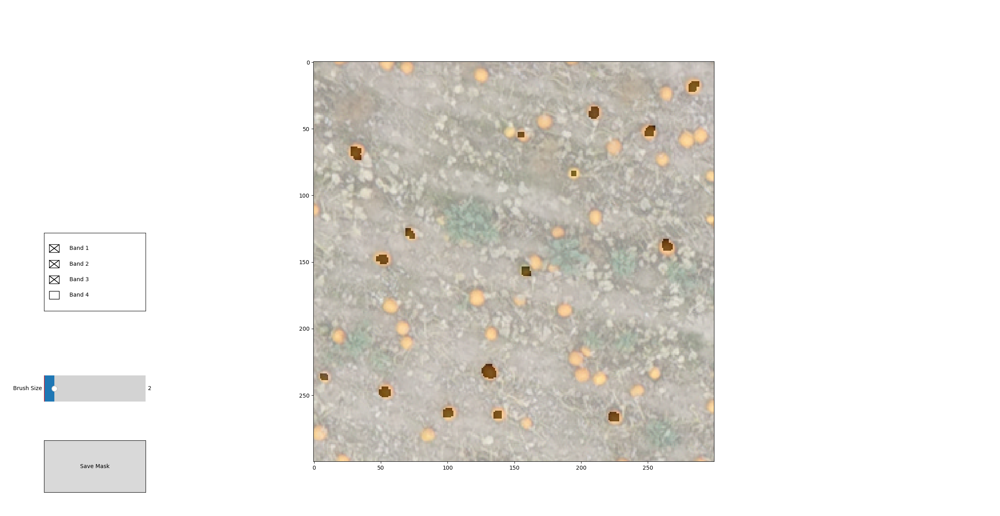
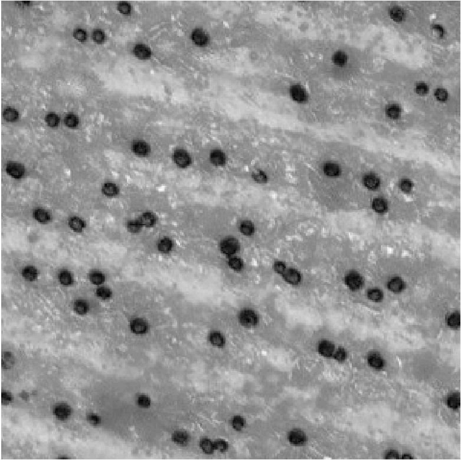

# Tutorial - 


The Orthomosaic-color-distance-calculater is a tool created for the purpose of locating objects in images/orthomosaics, using the the pixel values to distinguish them.
This tutorial will take you through the preporcessing and the application of this tool on a pumpkin field.


The program relies on an small sample of annotated pixels, from the objects to search for, to construct the color-model used to distinguish objects from background. The result is a distance image on which a threshold can be applied to achieve segmentation.

This repository furthermore includes a auxiliary tool for annotating images, as well as doing Receiver Operator Characteristics(ROC) to test the performance of segmentation and to choose optimal threshhold values.

The dependencies of the different parts of the repository is listed at the bottom of this tutorial.


# Tutorial: Creating distance image from orthomosaic


The following tutorial/example uses an orthomosaic of a pumpkin field as data, it can be downloaded using the following URL: [text](https://zenodo.org/records/8254412). The commands of the tutorial assumes the following file structure:
```bash
.
├── orthomosaic-color-distance-calculator  
│   
└── Dat
      └── 20190920_pumpkins_field_101_and_109-cropped.tif
```
Here "." indicates the current working directory, and the "Data" folder containing the example orthomosaic **20190920_pumpkins_field_101_and_109-cropped.tif** that we aim to segment.


# Preparing for segmentation

For the program to run it will need inputs beyond the image/orthomosaic to be segmented:

- Reference image: a **.tif** cutout of the larger target image/orthomosaic from which the annotation mask has been made, must include some of the objects of interest, preferably with the present in the larger orthomosaic different variations of lighting.
- Annotation mask: a **.tif** mask of the reference image indicating the pixels of the reference image representing the objects of interest. With values 0 indicating no object, and 255 indicating object. 

From these the program will be able to achieve the data needed for constructing its color-models.
Below is an example of how to construct the above inputs using the resources of the repository.

## Example:
The step is to create the reference image for annotation multiple tools can be used, we use the gdal library and the **gdal_translate** command:
```bash
    $ gdal_translate -srcwin 10000 8000 300 300 "Data 20190920_pumpkins_field_101_and_109-cropped.tif" Data/crop_from_orthomosaic.tif
```

From this the file **crop_from_orthomosaic.tif** should appear in the Data folder.

To Annotate the data we use the **color-based-imagesegmentation/Annotator/annotator.py** script: 
```bash
    $ python3 orthomosaic-color-distance-calculator/Annotator/annotator.py Data/crop_from_orthomosaic.tif
```
Using the GUI the reference image can be annotated using the left slider to change the size of the annotation brush, an example of an annotation can be seen here:



When a acceptable(the more pixels the better segmentation in general) annotation has been achieved press the **save mask** button and the resulting mask can be saved. Here we save the mask to the file **Data/ref_pixel_mask.tif** for future use.
With this we have the necesary files to continue with the segmentation


## Creating distance image
With the necessary setup, the distance image can be created using the **run_segmenter.py**.
The script takes three postitional arguments:

- Orthomosaic to be analysed
- Reference image
- Annotation mask

From this the script takes the orthomosaic divides it into smaller tiles and output a gray scale distance image of each tile. 
## Example:
With the reference image **verb|Data/crop_from_orthomosaic.tif** and mask **Data/ref_pixel_mask.tif** created above, the following command creates the distance image.
```bash
    $ python3 orthomosaic-color-distance-calculator/run_segmenter.py "Data/20190920_pumpkins_field_101_and_109-cropped.tif" "Data/crop_from_orthomosaic.tif" "Data/ref_pixel_mask.tif" 
```

This should result in a new folder in the current working directory named **output**. In this folder another folder **/mahal** contains the resulting distance images. By default the script divides the orthomosaic into tiles of 3000x3000 pixels. A cutout of a resulting distance image is shown below , and can be created using the command: 
```bash
    $ gdal_translate -srcwin 0 0 300 300 "output/mahal/mahal0062.tiff" "Data/crop_distance_image.tif"
```



In this distance image we can see the pumpkins in black/dark color indicating smalle distance form the reference pixels, and everything else in white/light color, a specific threshhold can the be applied to the image for a final segmentation.

